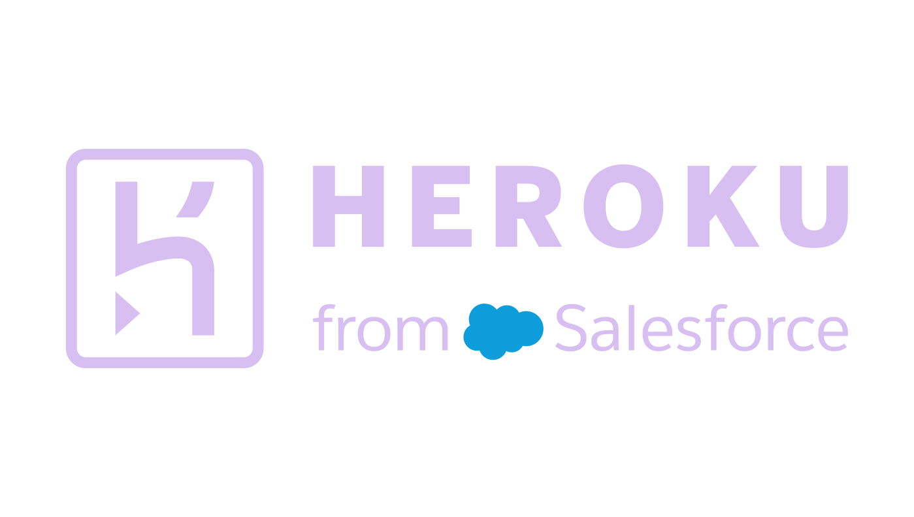

# Heroku Claude Source Plugin

This is the canonical Claude Code source plugin for the portable Heroku skills repo.

<p align="center">
  
  <span>&nbsp;&nbsp;&nbsp;</span>
  
</p>

- `.claude-plugin/plugin.json` contains the Claude plugin manifest.
- `.mcp.json` points Claude Code at a local `heroku-code-mcp` HTTP server.
- `assets/` contains plugin-local Heroku and Claude brand assets.
- `skills/` contains the plugin-local mirror of the portable root skill set.

Refresh the plugin-local skill mirror and build a distributable bundle with:

```bash
python3 scripts/build_claude_adapter.py
```

Start the MCP server separately before using the MCP tools:

```bash
cd ../heroku-code-mcp
TOKEN_STORE_PATH=./data/tokens.integration.json \
TOKEN_ENCRYPTION_KEY_BASE64='<seed-output-key>' \
PORT=3333 HOST=127.0.0.1 npm run dev
```

Load this plugin in Claude Code:

```bash
claude --plugin-dir /path/to/heroku-skills/dist/claude/heroku
```

Expected Claude Code init surface:

- plugin `heroku`
- skills such as `heroku:deploy-to-heroku`, `heroku:heroku-app-ops`, and `heroku:heroku-postgres`
- MCP server `plugin:heroku:heroku-code-mcp`
- MCP tools `auth_status`, `search`, and `execute`

For Claude Desktop, use the `.mcp.json` server definition directly in `~/Library/Application Support/Claude/claude_desktop_config.json`, or bridge to the local HTTP endpoint with `mcp-remote` if your Desktop build expects stdio MCP servers.
